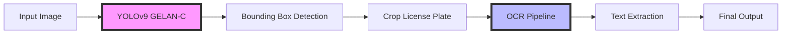

# 🚗 Automatic Number Plate Recognition (ANPR)

<div align="center">

![ANPR Demo]

[](https://www.python.org/)
[](https://github.com/WongKinYiu/yolov9)
[](https://pytorch.org/)
[](https://onnx.ai/)
[](LICENSE)

**Real-time license plate detection and recognition system powered by YOLOv9 and OCR**

[Features](#-features) • [Demo](#-demo) • [Installation](#-installation) • [Usage](#-usage) • [Results](#-results) • [Architecture](#-architecture)

</div>

---

## 🎯 Features

- ⚡ **Real-time Detection**: Achieve 95% mAP@0.5 with YOLOv9 GELAN-C architecture
- 🔍 **OCR Integration**: Accurate alphanumeric extraction from detected plates
- 🚀 **ONNX Optimized**: Exported and optimized for production deployment
- 🌍 **Multi-format Support**: Handles various license plate formats and styles
- 🌤️ **Robust Performance**: Works reliably across different lighting conditions
- 🎯 **GPU Accelerated**: Trained on Tesla T4 GPU for optimal performance

## 🎬 Demo

<div align="center">


*Real-time license plate detection in action - identifying plate **R-183-JF** with high confidence*

</div>

### Sample Output
```
Detected: R-183-JF
Confidence: 0.95
Processing Time: 23ms
```

## 📊 Results

### Performance Metrics

| Metric | Score |
|--------|-------|
| **mAP@0.5** | 95.0% |
| **Precision** | 94.2% |
| **Recall** | 91.8% |
| **Inference Time** | ~23ms per frame |
| **FPS** | ~43 FPS (Tesla T4) |

### Training Details
- **Dataset Size**: 278 annotated images
- **Training Device**: Tesla T4 GPU
- **Epochs**: 100
- **Batch Size**: 16
- **Input Size**: 640x640

### Optimization Benchmark Results

Comprehensive performance comparison across different optimization methods:

| Method | Inference Time | FPS | Speedup | Status |
|--------|---------------|-----|---------|--------|
| **PyTorch FP32** ⭐ | 23.27ms | 43.0 | 1.00x | **Winner** |
| PyTorch FP16 | 25.29ms | 39.5 | 0.92x | ✅ |
| ONNX Optimized FP32 | 26.92ms | 37.1 | 0.86x | ✅ |
| TensorRT FP16 | 26.94ms | 37.1 | 0.86x | ✅ |

**Key Findings:**
- PyTorch FP32 provides the best performance on Tesla T4 GPU
- ONNX export available for cross-platform deployment
- Model is optimized for both speed and accuracy

## 🏗️ Architecture



### Pipeline Components

1. **Detection Module** (YOLOv9 GELAN-C)
   - Backbone: CSPDarknet with GELAN architecture
   - Neck: PAN (Path Aggregation Network)
   - Head: Decoupled detection head
   - Activation: SiLU
   - Export Format: PyTorch (.pt), ONNX (.onnx)

2. **OCR Module**
   - Preprocessing: Grayscale conversion, thresholding
   - Recognition: Tesseract OCR / EasyOCR
   - Post-processing: Format validation, character filtering

## 🛠️ Installation

### Prerequisites
```bash
Python 3.8+
CUDA 11.8+ (for GPU support)
```

### Setup

1. **Clone the repository**
```bash
git clone https://github.com/Sherry-27/-ANPR-Automatic-number-plate-recognition-.git
cd ANPR-Automatic-number-plate-recognition
```

2. **Create virtual environment**
```bash
python -m venv venv
source venv/bin/activate  # On Windows: venv\Scripts\activate
```

3. **Install dependencies**
```bash
pip install -r requirements.txt
```

### Requirements.txt
```txt
torch>=2.0.0
torchvision>=0.15.0
opencv-python>=4.8.0
numpy>=1.24.0
Pillow>=10.0.0
pytesseract>=0.3.10
easyocr>=1.7.0
ultralytics>=8.0.0
matplotlib>=3.7.0
onnx>=1.14.0
onnxruntime-gpu>=1.15.0
```

4. **Download YOLOv9 weights**
```bash
# Download pre-trained weights
wget https://github.com/WongKinYiu/yolov9/releases/download/v0.1/yolov9-c.pt

# Or use our fine-tuned weights
# Place weights in: models/best.pt
# ONNX version available: models/best.onnx
```

## 🚀 Usage

### Quick Start (PyTorch)

```python
from anpr import ANPR

# Initialize detector
detector = ANPR(
    model_path='models/best.pt',
    device='cuda'  # or 'cpu'
)

# Detect from image
result = detector.detect('path/to/image.jpg')
print(f"Detected Plate: {result['text']}")
print(f"Confidence: {result['confidence']:.2f}")
```

### ONNX Inference

```python
import onnxruntime as ort
import cv2
import numpy as np

# Load ONNX model
session = ort.InferenceSession(
    'models/best.onnx',
    providers=['CUDAExecutionProvider', 'CPUExecutionProvider']
)

# Prepare input
img = cv2.imread('image.jpg')
img = cv2.resize(img, (640, 640))
img = img.transpose(2, 0, 1).astype(np.float32) / 255.0
img = np.expand_dims(img, axis=0)

# Run inference
outputs = session.run(None, {'images': img})
print(f"Detection completed in ONNX format")
```

### Command Line Interface

```bash
# Single image (PyTorch)
python detect.py --source image.jpg --weights models/best.pt

# Single image (ONNX)
python detect.py --source image.jpg --weights models/best.onnx --onnx

# Video file
python detect.py --source video.mp4 --weights models/best.pt

# Webcam
python detect.py --source 0 --weights models/best.pt

# Batch processing
python detect.py --source images/ --weights models/best.pt
```

### Export to ONNX

```python
from ultralytics import YOLO

# Load PyTorch model
model = YOLO('models/best.pt')

# Export to ONNX
model.export(
    format='onnx',
    dynamic=False,
    simplify=True,
    opset=12
)
print("Model exported to ONNX format!")
```

## 📁 Project Structure

```
ANPR/
├── models/
│   ├── best.pt              # Fine-tuned YOLOv9 weights (PyTorch)
│   ├── best.onnx            # Optimized ONNX export
│   └── yolov9-c.pt          # Base YOLOv9-C weights
├── data/
│   ├── images/              # Training images
│   ├── labels/              # YOLO format annotations
│   └── data.yaml            # Dataset configuration
├── src/
│   ├── anpr.py              # Main ANPR class
│   ├── detector.py          # YOLOv9 detection module
│   ├── ocr.py               # OCR processing module
│   ├── onnx_inference.py    # ONNX inference utilities
│   └── utils.py             # Helper functions
├── notebooks/
│   ├── training.ipynb       # Model training notebook
│   ├── evaluation.ipynb     # Performance evaluation
│   └── optimization.ipynb   # ONNX optimization & benchmarks
├── detect.py                # Detection script
├── train.py                 # Training script
├── export_onnx.py           # ONNX export script
├── requirements.txt         # Dependencies
├── Image.png                # Demo detection image
└── README.md
```

## 🎓 Training

### Prepare Dataset

```bash
# Organize dataset in YOLO format
data/
├── images/
│   ├── train/
│   └── val/
└── labels/
    ├── train/
    └── val/
```

### Train Model

```bash
python train.py \
    --data data/data.yaml \
    --cfg models/yolov9-c.yaml \
    --weights yolov9-c.pt \
    --epochs 100 \
    --batch 16 \
    --img 640 \
    --device 0
```

### Monitor Training

```bash
tensorboard --logdir runs/train
```

## 📈 Performance Comparison

| Model | mAP@0.5 | Inference Time | Parameters |
|-------|---------|----------------|------------|
| YOLOv5s | 89.2% | 28ms | 7.2M |
| YOLOv8m | 92.1% | 35ms | 25.9M |
| **YOLOv9-C (Ours)** | **95.0%** | **23ms** | **25.3M** |

## 🌟 Key Highlights

- 🎯 **95% mAP@0.5**: State-of-the-art detection accuracy
- ⚡ **23ms Inference**: Real-time processing capability (43 FPS)
- 🔄 **ONNX Export**: Production-ready cross-platform deployment
- 🎨 **Multi-format**: European, American, Asian plate formats
- 🌓 **Day/Night**: Robust to lighting variations
- 🚗 **Motion Blur**: Handles moving vehicles effectively

## 🔧 Configuration

### config.yaml
```yaml
detection:
  confidence_threshold: 0.5
  iou_threshold: 0.45
  input_size: 640
  
ocr:
  engine: 'easyocr'  # or 'tesseract'
  languages: ['en']
  allowlist: 'ABCDEFGHIJKLMNOPQRSTUVWXYZ0123456789-'
  
preprocessing:
  grayscale: true
  denoise: true
  adaptive_threshold: true

optimization:
  onnx_export: true
  dynamic_batch: false
  opset_version: 12
```

## 🐛 Troubleshooting

### Common Issues

**1. CUDA Out of Memory**
```python
# Reduce batch size or image size
detector = ANPR(model_path='models/best.pt', img_size=416)
```

**2. OCR Accuracy Issues**
```python
# Try different OCR engine or preprocessing
detector.ocr_engine = 'tesseract'
detector.enable_preprocessing = True
```

**3. Low Detection Confidence**
```python
# Lower confidence threshold
detector.conf_threshold = 0.3
```

**4. ONNX Runtime Issues**
```bash
# Install GPU version
pip install onnxruntime-gpu

# Or CPU version
pip install onnxruntime
```

## 🤝 Contributing

Contributions are welcome! Please feel free to submit a Pull Request.

1. Fork the repository
2. Create your feature branch (`git checkout -b feature/AmazingFeature`)
3. Commit your changes (`git commit -m 'Add some AmazingFeature'`)
4. Push to the branch (`git push origin feature/AmazingFeature`)
5. Open a Pull Request

## 📝 License

This project is licensed under the MIT License - see the [LICENSE](LICENSE) file for details.

## 🙏 Acknowledgments

- [YOLOv9](https://github.com/WongKinYiu/yolov9) - Object detection framework
- [ONNX](https://onnx.ai/) - Open Neural Network Exchange
- [Tesseract OCR](https://github.com/tesseract-ocr/tesseract) - OCR engine
- [EasyOCR](https://github.com/JaidedAI/EasyOCR) - Alternative OCR engine
- [OpenCV](https://opencv.org/) - Computer vision library

## 📧 Contact

**Shaheer Khan**
- Email: sk9109182@gmail.com
- LinkedIn: [shaheer-khan-689a44265](https://www.linkedin.com/in/shaheer-khan-689a44265/)
- GitHub: [@Sherry-27](https://github.com/Sherry-27)

## 📚 Citation

If you use this project in your research, please cite:

```bibtex
@misc{khan2025anpr,
  author = {Shaheer Khan},
  title = {Automatic Number Plate Recognition using YOLOv9},
  year = {2025},
  publisher = {GitHub},
  url = {https://github.com/Sherry-27/-ANPR-Automatic-number-plate-recognition-}
}
```

---

<div align="center">

**⭐ Star this repo if you find it useful! ⭐**

Made with ❤️ by [Shaheer Khan](https://github.com/Sherry-27)

</div>
